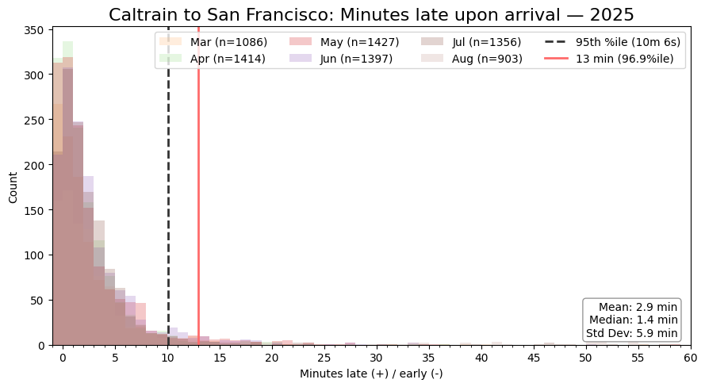

# pyfiveoneone
Helpers for 511 Transit (SFBay). https://511.org/open-data/transit

How cool of the data to be open:



## How to use
1. Get an api key from https://511.org/open-data/token

2. Store api key in environment variable `FIVEONEONE_API_KEY`

3. Create a `Client()` object with your api key.

```python
client = Client()

resp = client.gtfs_operators()
# OR
resp = client.gtfs_feed_download(operator_id, zip_path, MM="05", YYYY="2025")

with open("gtfs_operators.json", "w") as f:
    json.dump(resp, f, indent=4)
```
## Autogenerated 'static' models
These files are to be used as inputs to queries, so data structures are autogenerated for ease of use. The source of truth for this data is in the API, so these fields will be automatically updated on (rare) API break.
* Operators
* Calendar Attributes
* Calendar
* Routes
* Stops
* Directions
* Rider Categories

Checkout `models.py` to see the information available for each type.

## Queried Fields
These fields are realtime updated and need to be queried in real time
* Trips
* Scheduled departues at stop
* Obsered arrival times (gtfs historic feed)